# Flank v4

### A consolidation-zone continuation system, and why its edge could not be funded

**Thabo Claude Chipokolo**
August 2026

---

## Abstract

Flank is a rule-based trading system that enters continuation trades inside consolidation zones identified by a purpose-built detection engine. This paper documents the full specification, the MQL5 implementation, and an out-of-sample evaluation across a broad instrument universe on MetaTrader 5.

Two results are reported. First, the system produced a positive expectancy on a small subset of large-cap equities and on nothing else. Second, and more consequentially, the position sizes implied by the risk model cannot be financed at the margin rates that apply to equities. The strategy is profitable in a backtest and unfundable in an account. That second result is the reason this work is published as research rather than deployed.

---

## 1. Motivation

Most published retail strategy research stops at the equity curve. A backtest returns a profit factor above one, the curve slopes upward, and the work is declared finished. The gap between that point and a live account is rarely measured.

Flank was built to test a specific hypothesis: that price consolidation is a *market state* rather than a shape on a chart, and that if the state can be detected online without lookahead, entering in the direction of the prevailing trend from inside that state produces a measurable edge.

The hypothesis is testable. It was tested, and the answer is qualified.

---

## 2. System specification

The specification below is the complete rule set. It was fixed before any code was written and was not altered during evaluation.

### 2.1 Definitions

**RSI overbought.** RSI greater than or equal to 70.

**RSI oversold.** RSI less than or equal to 30.

**Resting point.** The state in which the system suspends new entries because price is overbought or oversold on the resting timeframe. The state persists until price retests the SMMA-9 on that timeframe.

- If price is overbought, stop placing trades until price retests SMMA-9.
- If price is oversold, stop placing trades until price retests SMMA-9.

**Trend direction.** Established by an SMMA-9 break and retest on the trend timeframe.

- If price breaks and retests below SMMA-9, the trend is bearish.
- If price breaks and retests above SMMA-9, the trend is bullish.

Trend direction persists until the opposite break and retest completes.

**Consolidation zone.** The zone produced by the Consolidation Detection Engine described in section 3.

**Volatility.** Price movement measured by Average True Range on the volatility timeframe.

**1:1 RR.** The ratio of unrealised profit to the initial risk of a trade.

**Dynamic exit.** Close a trade when its drawdown from peak unrealised profit reaches 30 percent or more.

### 2.2 Rules

1. Do not trade against the trend direction.
2. Do not place trades when the Choppiness Index is greater than or equal to 50.5, or when Choppiness is rising, on the choppiness filter timeframe.
3. Do not open trades while in a resting point.
4. All rules must be satisfied for a trade to be placed.
5. A maximum of three open positions is permitted.

### 2.3 Execution

Trades are executed inside a consolidation zone on the execution timeframe. Each trade must follow the trend direction. Only one trade is permitted per consolidation zone.

- If the trend is bullish and price is inside a consolidation zone, buy.
- If the trend is bearish and price is inside a consolidation zone, sell.

An inverted toggle reverses the buy and sell mapping, retained as a control condition.

Risk is fixed at 1 percent of account capital per trade.

### 2.4 Exit

**Stop loss.** Placed and trailed at twice the volatility measured at the time the trade is opened.

**Take profit.** A hard target at five times the same volatility measurement, combined with the dynamic exit rule. The dynamic exit is dormant until the trade reaches 1:1 RR, at which point it arms. Before 1:1 RR the trailing stop is the only exit besides the hard target.

---

## 3. Consolidation Detection Engine

The engine treats consolidation as a market state with an expected drift near zero, judged per bar against several measurable features rather than matched against a geometric template. Detected states are converted into zone objects by a finite state machine:

```
IDLE  ->  FORMING (candidate)  ->  ACTIVE (confirmed)  ->  breakout or dissolve
```

A zone is only confirmed after a minimum number of closed bars have satisfied the state test, with a tolerance allowance for intervening bars that do not. Nothing in the engine reads future data. A zone appears several bars into a consolidation because that is the earliest point at which an online detector could have known it was there.

The feature set and the threshold logic are deliberately not documented in detail here. The state machine, which is the part that determines when a zone exists and when it stops existing, is reproduced below. Full source is in `src/Flank v4.mq5`.

```mql5
//--- process exactly one closed bar at `shift`
void ProcessBar(const int shift)
{
   double er, slp, rng, cmp, chp;
   if(!ComputeFeatures(shift, er, slp, rng, cmp, chp)) return;

   const double atrN = IndVal(hAtrZone, shift);
   if(!IsValid(atrN) || atrN <= 0.0) return;

   const bool isConsol = EvalConsolidation(er, slp, rng, cmp, chp);

   const double bHigh  = /* high  of bar at shift */;
   const double bLow   = /* low   of bar at shift */;
   const double bClose = /* close of bar at shift */;

   if(m_st == 0)                                   // ---- IDLE ----
   {
      if(isConsol)
      {
         m_st     = 1;
         m_zTop   = bHigh;
         m_zBot   = bLow;
         m_nBars  = 1;
         m_tolCnt = 0;
      }
   }
   else if(m_st == 1)                              // ---- FORMING ----
   {
      if(isConsol)
      {
         m_zTop = MathMax(m_zTop, bHigh);
         m_zBot = MathMin(m_zBot, bLow);
         m_nBars++;
         m_tolCnt = 0;

         if(m_nBars >= InpMinBars && TouchesSatisfied())
         {
            m_st = 2;                              // zone CONFIRMED
            m_zoneId++;
         }
      }
      else
      {
         m_tolCnt++;
         if(m_tolCnt > InpMaxTol) m_st = 0;        // candidate dies
      }
   }
   else if(m_st == 2)                              // ---- ACTIVE ----
   {
      const bool brokeUp   = (bClose > m_zTop + InpBrkBuf * atrN);
      const bool brokeDown = (bClose < m_zBot - InpBrkBuf * atrN);

      if(brokeUp || brokeDown)
      {
         m_st = 0;                                 // breakout
      }
      else
      {
         m_tolCnt = isConsol ? 0 : m_tolCnt + 1;

         if(m_tolCnt > InpMaxTol)
         {
            m_st = 0;                              // dissolved
         }
         else
         {
            m_zTop = MathMax(m_zTop, bHigh);
            m_zBot = MathMin(m_zBot, bLow);
            m_nBars++;
         }
      }
   }
}
```

Because the state machine is path dependent from the start of history, the implementation replays a warm-up window of closed bars at initialisation so that a backtest and a live instance arrive at the same state from the same data.

---

## 4. Implementation notes

Several points in the specification admitted more than one reading. Each was resolved explicitly and exposed as an input so the alternative remains testable.

**Initial risk is locked at entry.** The stop loss trails, so measuring 1:1 RR against the live stop would make the arming threshold a moving target. The distance from entry to the initial stop is frozen at fill and used for both position sizing and the RR test.

**The trail and the dynamic exit overlap.** A trail at twice volatility caps giveback at one unit of initial risk. The dynamic exit caps giveback at 30 percent of peak. Once armed at 1:1 RR the dynamic exit is always the tighter of the two, so the trail functions as the pre-1R backstop and nothing more.

**The hard target is rarely reached.** A target at five times volatility is 2.5R against a stop at two times volatility. For price to travel from 1R to 2.5R without a 30 percent retracement from peak is uncommon. The hard target is a tail-case ceiling rather than a working exit.

**Break and retest was undefined.** Implemented as: a close crossing the SMMA-9 constitutes the break; a later bar whose wick returns to the SMMA-9 and closes back on the break side constitutes the retest, within a bounded window. The retest cannot occur on the break bar itself.

**Resting point scope.** Read literally, suspension applies to all entries rather than only to the extreme side. Both readings are implemented; the literal one is the default and was used throughout.

**Zone membership is implicit.** The engine expands the zone boundary to contain every bar it accepts, so price is always inside an active zone by construction. The condition "price is in a consolidation zone" therefore reduces to the zone being in the ACTIVE state.

All higher-timeframe reads use closed bars only. Entries are evaluated at the close of a completed execution-timeframe bar and filled at the open of the next.

---

## 5. Method

Testing ran on MetaTrader 5 against a broker feed with history quality of 97 percent or above on every instrument reported, over the period January 2022 to July 2026.

The evaluation ran in two stages.

**Stage 1.** The system was run at its specified default timeframes across the full Market Watch universe with no optimisation of any parameter. The purpose was to find out whether the edge existed anywhere before spending effort on tuning.

**Stage 2.** On the two instruments that ranked highest in stage 1, the five engine timeframes were searched. No other parameter was altered. The detection window, thresholds, zone construction, risk fraction, stop multiple, target multiple and dynamic exit percentage all remained at their stage 1 values.

Account conditions for stage 1 were a 100,000 unit deposit at 1:100 leverage. Stage 2 used a 10,000 unit deposit at the same leverage. Risk was 1 percent of balance per trade throughout, with a margin utilisation ceiling of 15 percent of free margin per position.

---

## 6. Results

### 6.1 Stage 1: unoptimised scan

The scan failed on every instrument outside equities. Among equities it separated into a small group with positive expectancy and a larger group without.

| Instrument | Profit factor | Trades | Sharpe | Max equity drawdown |
|---|---|---|---|---|
| TSLA | 1.25 | 727 | 3.13 | 22.60% |
| BABA | 1.18 | 636 | 1.75 | 18.94% |
| AAPL | 1.17 | 710 | 1.78 | 13.07% |
| META | 1.13 | 670 | 1.49 | 27.65% |

NFLX, AMZN, LVMH and PLTR did not produce a positive result. The strongest non-equity instrument was XAUUSD at a profit factor of 0.99 across 2,488 trades with a 63.62 percent equity drawdown, which is a loss, not a near miss.

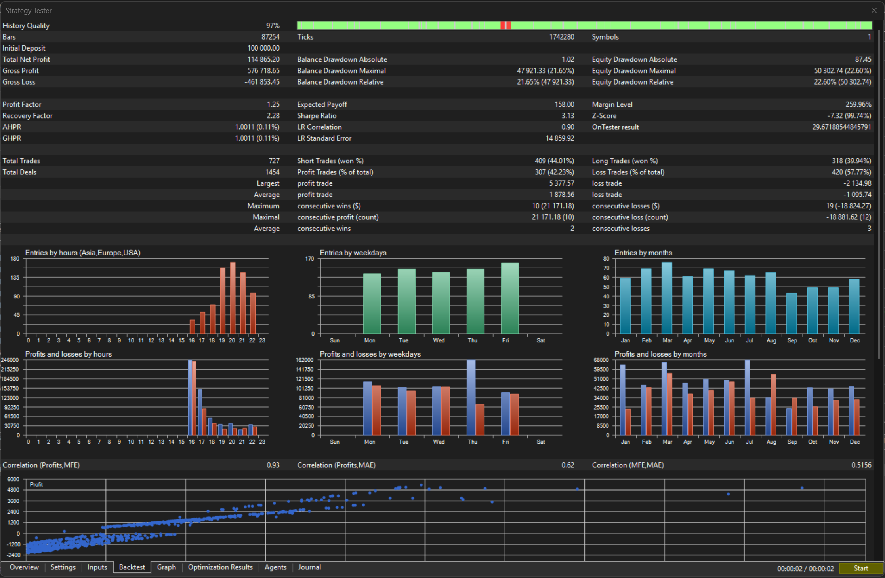
*Figure 1. Stage 1, TSLA. Profit factor 1.25 across 727 trades, Sharpe 3.13.*

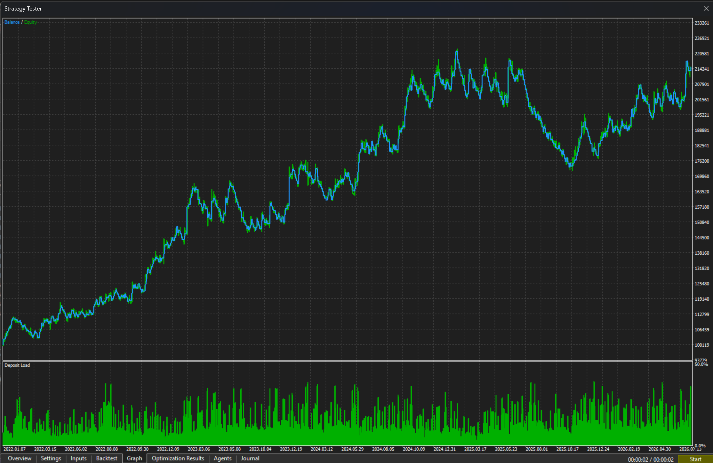
*Figure 2. Stage 1, TSLA equity and balance curve with deposit load.*

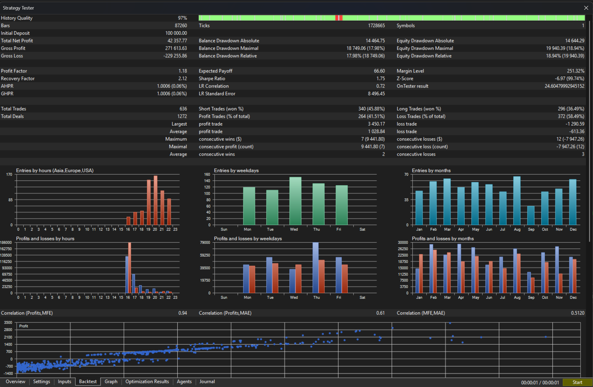
*Figure 3. Stage 1, BABA. Profit factor 1.18 across 636 trades.*

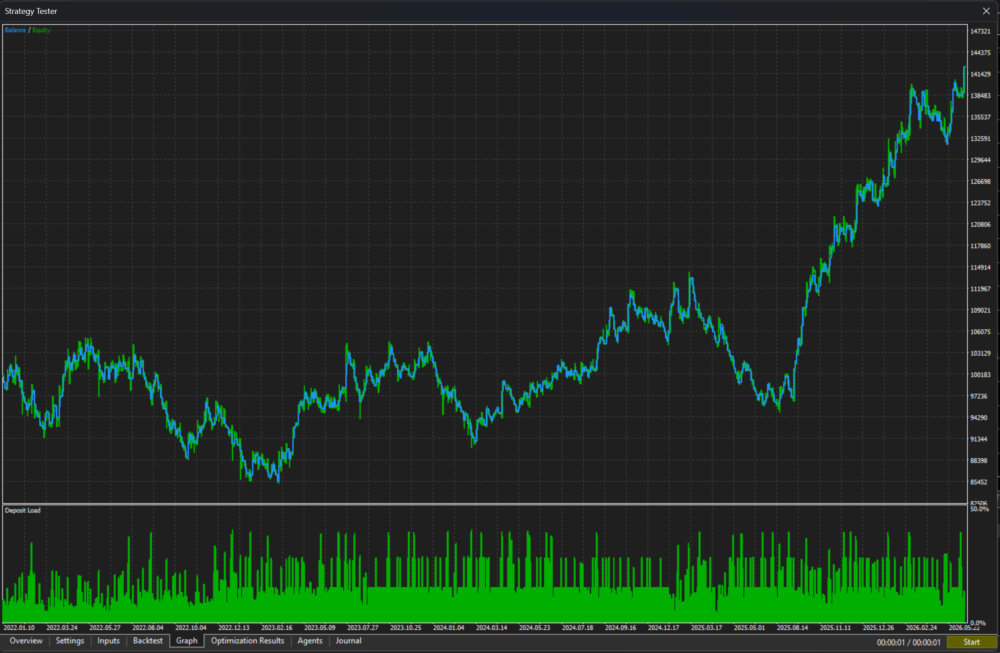
*Figure 4. Stage 1, BABA equity and balance curve.*

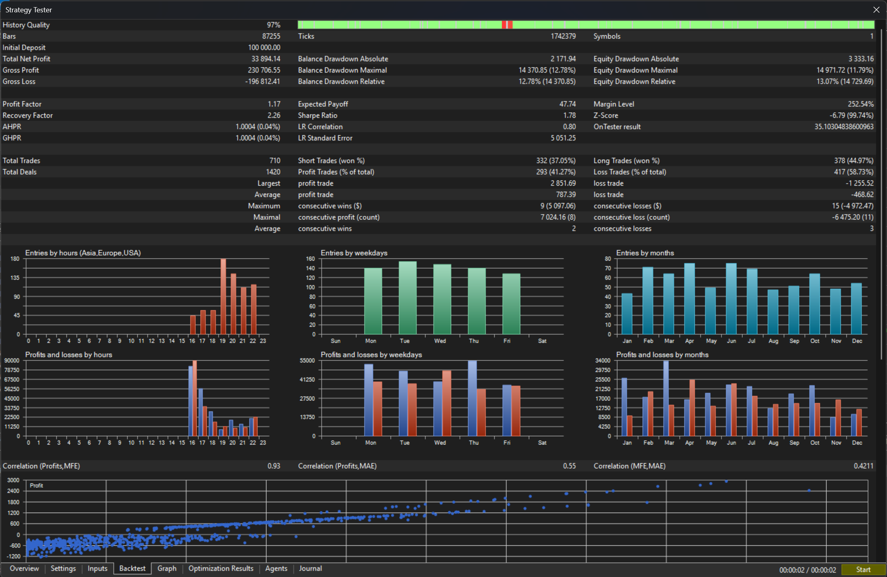
*Figure 5. Stage 1, AAPL. Profit factor 1.17 across 710 trades.*

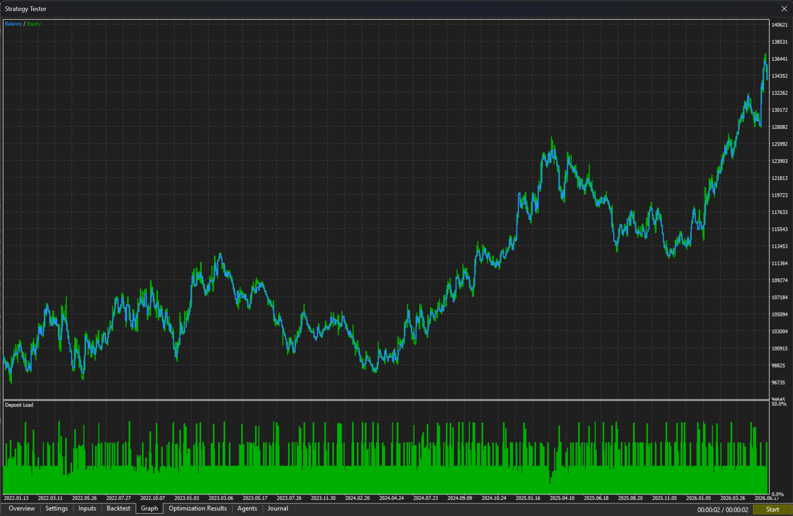
*Figure 6. Stage 1, AAPL equity and balance curve.*

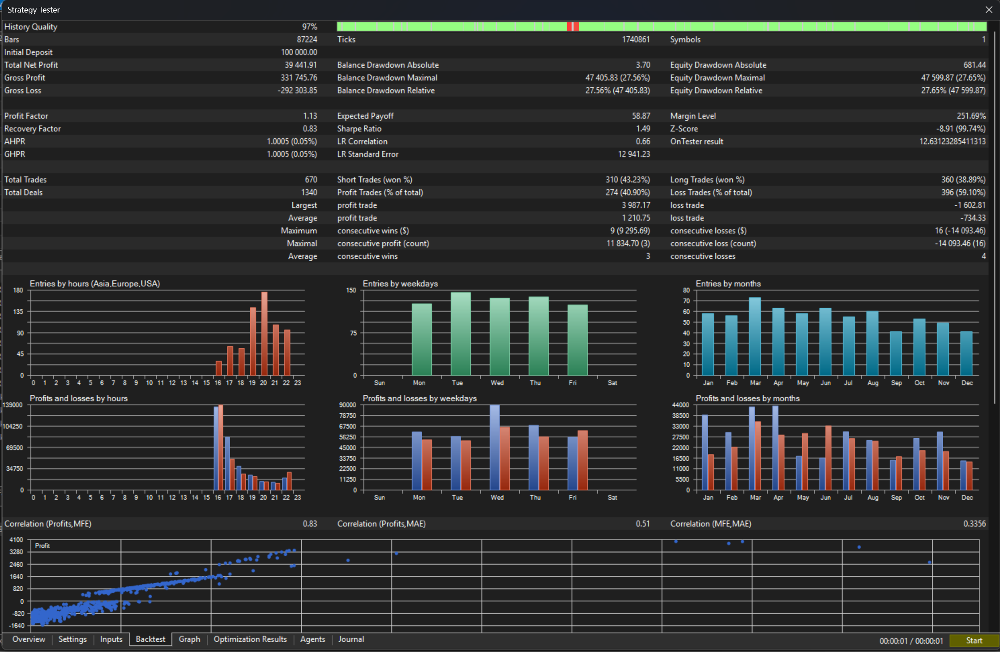
*Figure 7. Stage 1, META. Profit factor 1.13 across 670 trades, the weakest of the four.*

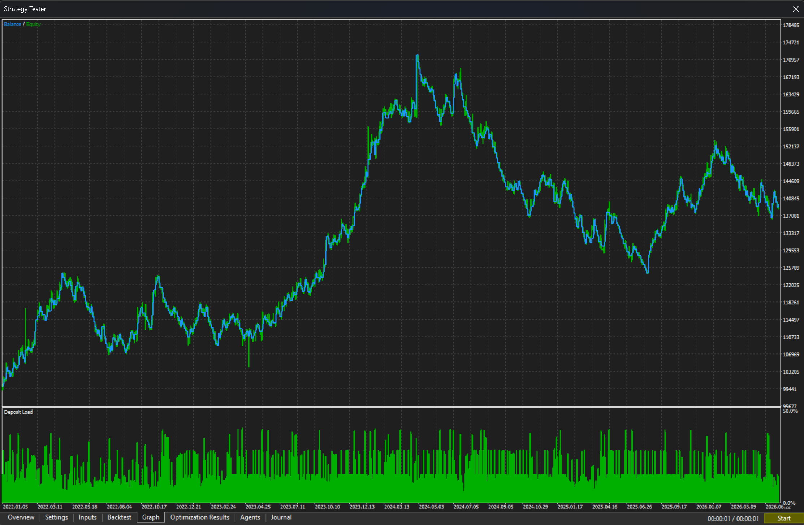
*Figure 8. Stage 1, META equity and balance curve.*

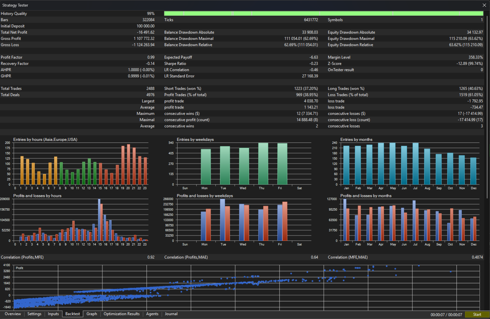
*Figure 9. Stage 1, XAUUSD. Profit factor 0.99 across 2,488 trades with a 63.62 percent equity drawdown. The strongest non-equity result in the scan and a clear failure.*

### 6.2 Stage 2: timeframe selection

Searching only the five engine timeframes moved the system from a five-minute execution frame to a one-minute one, with the trend frame at fifteen minutes and the volatility and resting frames at thirty minutes.

| Instrument | Profit factor | Trades | Net return | Sharpe | Recovery factor | Max equity drawdown |
|---|---|---|---|---|---|---|
| BABA | 1.46 | 2,134 | +894.8% | 4.68 | 10.29 | 11.24% |
| TSLA | 1.35 | 2,599 | +730.4% | 3.90 | 11.10 | 26.30% |

Compounded over the 4.5 year window this is a 66.2 percent annual rate on BABA and 59.7 percent on TSLA.

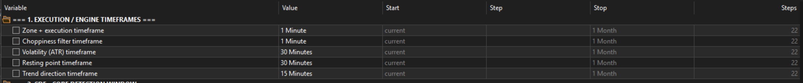
*Figure 10. The selected timeframe configuration. These five values are the only parameters that differ from stage 1.*

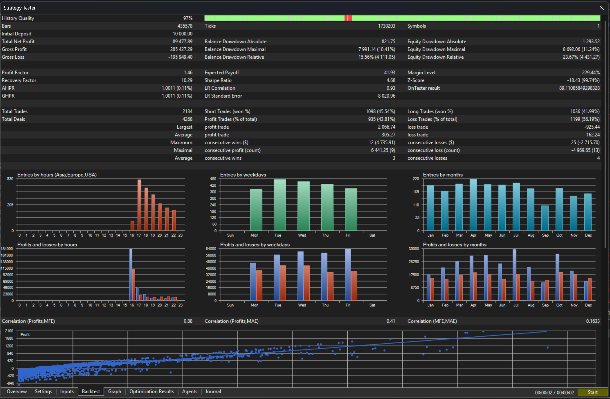
*Figure 11. Stage 2, BABA. Profit factor 1.46 across 2,134 trades, Sharpe 4.68, recovery factor 10.29.*

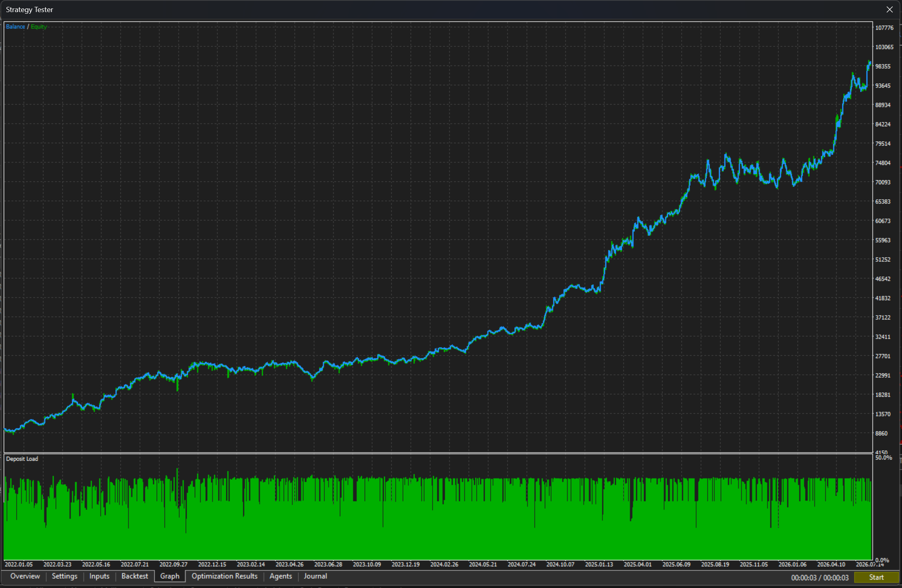
*Figure 12. Stage 2, BABA equity and balance curve. Deposit load peaks near 50 percent at 1:100 leverage.*

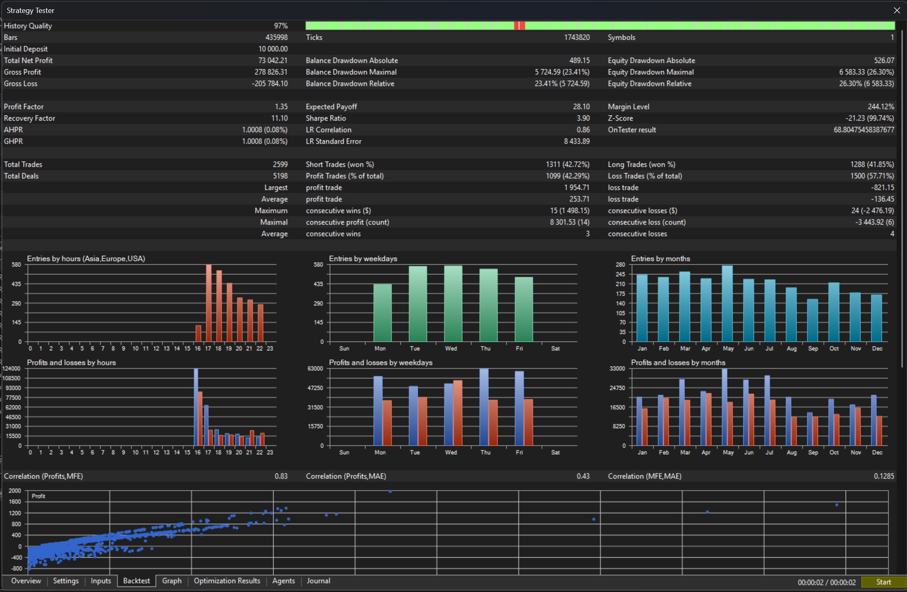
*Figure 13. Stage 2, TSLA. Profit factor 1.35 across 2,599 trades, Sharpe 3.90, recovery factor 11.10.*

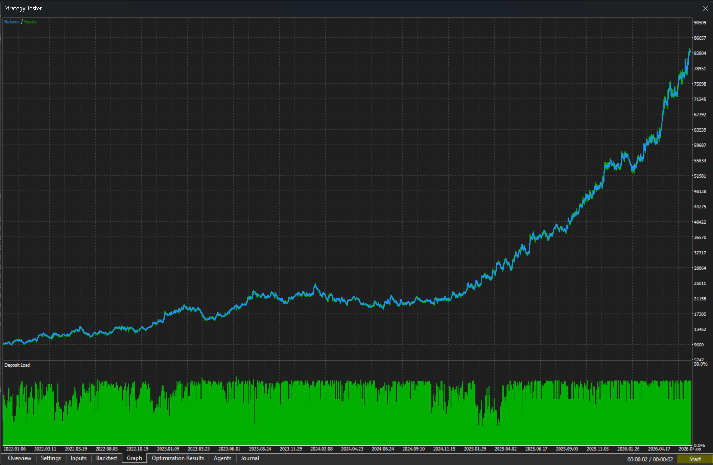
*Figure 14. Stage 2, TSLA equity and balance curve.*

These figures are the reason the rest of this paper exists, because taken alone they are misleading in two separate ways.

---

## 7. Statistical assessment

Per-trade expectancy was tested against the null hypothesis of zero mean, using the reported win rate and average win and loss to reconstruct the trade distribution. The standard deviations are two-point approximations and therefore understate true dispersion, since every run has a long right tail. All t-statistics below are optimistic.

**Stage 1, unoptimised:**

| Instrument | Trades | t | one-sided p |
|---|---|---|---|
| TSLA | 727 | 2.94 | 0.002 |
| AAPL | 710 | 2.14 | 0.016 |
| BABA | 636 | 2.13 | 0.017 |
| META | 670 | 1.66 | 0.049 |
| XAUUSD | 2,488 | −0.17 | 0.57 |

A scan across roughly thirty instruments requires a t-statistic near 2.94 to clear a Bonferroni correction at the 5 percent level. TSLA sits exactly on that boundary with optimistic variance. Nothing else clears.

Two further observations weaken the stage 1 result.

The instrument split is not shaped like an asset class. AMZN and META are close substitutes: same sector, same session, similar volatility regime, same index membership. An edge that captures META and fails AMZN is not describing a property of equities. It is describing noise that happened to land on one side of zero. If the effect were real and equity specific, the large-cap technology names would cluster together rather than split.

Z-scores across every run fall between −6.8 and −21.2 at 99.74 percent confidence, indicating strong serial dependence in the trade sequence. Effective sample size is therefore materially smaller than the nominal trade count, and the t-statistics above are inflated a second time.

**Stage 2, after timeframe selection:** TSLA returns t = 7.55 and BABA t = 8.48. These numbers should not be read as evidence. The timeframes were selected on the same data used to compute them, which makes the stage 2 results in-sample by construction. The correct statement is that a timeframe configuration exists which fits this data well. Whether it generalises is untested, and the honest way to test it is a walk-forward analysis on data held back from the search, which this study does not yet include.

---

## 8. The capital efficiency constraint

This is the finding that decides the outcome.

Every backtest above ran at 1:100 leverage. That rate applies to CFD and foreign exchange instruments. It does not apply to equities, where 1:3 is typical under the account conditions available.

The stage 2 runs peaked at roughly 50 percent deposit load at 1:100, visible in the lower panel of figures 12 and 14. Equity margin is 33.3 times more expensive, so the same position set at 1:3 would demand roughly 1,667 percent of the account. It is not a matter of a large drawdown or an uncomfortable margin level. The positions cannot be opened at all.

The cause is structural rather than incidental. A stop at twice the thirty-minute ATR on a large-cap equity is a small fraction of the instrument price, on the order of one percent of notional. Risking one percent of account equity behind a stop that tight requires notional exposure close to the full account balance for a single position, and the specification permits three. Under 1:100 that is affordable. Under 1:3 it is not.

Holding margin level constant at 1:3 requires dividing position size by 33, which turns 1 percent risk per trade into roughly 0.03 percent. Applied to the TSLA result, a 730 percent return becomes approximately 22 percent over four and a half years, before the commission drag discussed below.

The general statement is that the system generates too little expectancy per unit of margin consumed to survive equity margin rules. Raising capital does not fix this, because the constraint scales with the account. What would fix it is a wider stop relative to instrument price, a far smaller risk fraction with correspondingly smaller returns, or an instrument class where margin is cheap. The last of those was tested in stage 1 and the system did not work there.

---

## 9. Limitations

**Stage 2 is in-sample.** Timeframe selection and performance measurement used the same data. No walk-forward validation has been run.

**Transaction costs are incompletely modelled.** Stage 2 executes between 2,100 and 2,600 trades on a one-minute execution frame. Spread is included in the tester. Commission is not modelled, and on equity CFDs at this trade count it is material. Average win in the TSLA run is 253.71 units against an average loss of 136.45. A per-trade cost in the low single digits would consume a visible share of the expectancy.

**Survivorship in the instrument universe.** The Market Watch list contains instruments the broker offers today. Delisted and restructured names are absent.

**Single broker, single feed.** All results come from one price feed. Nothing here has been reproduced against an independent data source.

**No live or forward testing.** Every figure in this paper is a simulation.

---

## 10. Conclusion

The consolidation detection engine works as designed. It identifies zones online without lookahead and the finite state machine behaves consistently across instruments.

The trading system built on top of it does not clear the bar for deployment. At its specified parameters it produced results indistinguishable from noise once multiple testing across the instrument universe is accounted for, and the pattern of winners and losers within the equity group does not look like a real asset-class effect. After timeframe selection it produced strong numbers that have not been validated out of sample.

Even setting both of those aside, the system fails a constraint that no amount of parameter work can address. The edge, such as it is, exists only at leverage that equities do not receive. This is not a shortage of capital. It is a shortage of expectancy per unit of margin.

The useful output of this project is therefore the engine, the implementation methodology, and the constraint itself. Return per unit of margin consumed is a screening criterion that belongs earlier in the research process than it is usually placed. A strategy that cannot be financed is not a strategy, and finding that out at the end of a study is more expensive than finding it out at the start.

---

## Appendix A: Parameters

Stage 2 configuration, as shipped in `params/Flank v4 TSLA.set`. Only the five timeframes differ from the stage 1 defaults.

| Parameter | Stage 1 | Stage 2 |
|---|---|---|
| Zone and execution timeframe | M5 | M1 |
| Choppiness filter timeframe | M15 | M1 |
| Volatility (ATR) timeframe | H1 | M30 |
| Resting point timeframe | H2 | M30 |
| Trend direction timeframe | H4 | M15 |
| Detection window | 20 bars | 20 bars |
| Minimum bars to confirm zone | 8 | 8 |
| Noisy bars tolerated | 2 | 2 |
| SMMA period | 9 | 9 |
| RSI period / levels | 14, 70 / 30 | 14, 70 / 30 |
| Choppiness block level | 50.5 | 50.5 |
| Risk per trade | 1.0% | 1.0% |
| Maximum concurrent positions | 3 | 3 |
| Margin ceiling per position | 15% of free margin | 15% of free margin |
| Stop loss | 2 x ATR | 2 x ATR |
| Hard take profit | 5 x ATR | 5 x ATR |
| Dynamic exit arms at | 1.0 R | 1.0 R |
| Dynamic exit giveback | 30% | 30% |

## Appendix B: Test conditions

| | Stage 1 | Stage 2 |
|---|---|---|
| Platform | MetaTrader 5 | MetaTrader 5 |
| Period | Jan 2022 to Jul 2026 | Jan 2022 to Jul 2026 |
| Modelling | Every tick based on real ticks | Every tick based on real ticks |
| History quality | 97% or above | 97% |
| Deposit | 100,000 | 10,000 |
| Leverage | 1:100 | 1:100 |
| Universe | Full Market Watch | TSLA, BABA |
